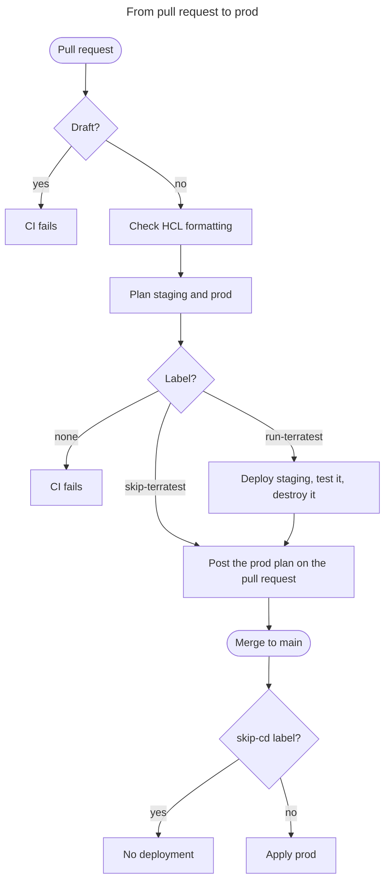

# CI/CD

Each EKS Forge repository has its own CI, but only the live repository has a CD, which deploys to `prod`. This page explains why, and why each pipeline behaves the way it does.
For the steps to ship a change, see [Release a Change to Production](/docs/deployment/release-a-change-to-production/). For how a change moves from `dev` to `prod`, see [Environments](/docs/iac/#environments).

If a job fails, see the guide for its repository:
- [Troubleshoot Catalog CI](/docs/ci-cd/per-repository/troubleshoot-catalog-ci/)
- [Troubleshoot Live CI](/docs/ci-cd/per-repository/troubleshoot-live-ci/)
- [Troubleshoot App of Apps CI](/docs/ci-cd/per-repository/troubleshoot-app-of-apps-ci/)

## Three Pipelines
The catalog CI and the app of apps CI check a change without deploying it. The live CI deploys it to `staging`:

| | What CI runs | What it deploys | What a green run proves |
|---|---|---|---|
| **Catalog** | Static checks, then a plan of the `dev` stack | Nothing | The modules and units are valid, and the stack plans |
| **App of apps** | Lint, validation, and scans of every chart | Nothing | The charts render and pass the checks |
| **Live** | Plans of `staging` and `prod`, then [infrastructure tests](/docs/ci-cd/testing/) on `staging` | `staging`, destroyed after the tests | The whole stack deploys and works end to end |

The [catalog CI](https://github.com/ConsciousML/terragrunt-template-catalog-eks/blob/main/.github/workflows/ci.yaml) plans the `dev` stack and never applies it. It sets [`TG_ENVIRONMENT`](/docs/reference/environment_variable/) to `catalog-eks-ci`, so the plan runs against its own empty state, not your `dev` environment's. An apply would build a full cluster on every pull request, which the live CI already does once per release.

The [app of apps CI](https://github.com/ConsciousML/argocd-app-of-apps-template/blob/main/.github/workflows/ci.yaml) renders each chart on its own, without a cluster and without the values the catalog injects at deploy time. Charts that need those values ship dummy ones for CI (see [Placeholder Values](/docs/applications/how-the-app-of-apps-works/#placeholder-values)).

The trade-off is that a green catalog or app of apps CI doesn't show the change works on a cluster. Only the live CI does, by deploying `staging` from scratch (see [Why Ephemeral Staging](/docs/ci-cd/limitations-and-improvements/#why-ephemeral-staging)).

## The Live Flow
A pull request in the live repository goes through CI, then CD once it's merged:

For the jobs themselves, see [`ci.yaml`](https://github.com/ConsciousML/terragrunt-template-live-eks/blob/main/.github/workflows/ci.yaml) and [`cd.yaml`](https://github.com/ConsciousML/terragrunt-template-live-eks/blob/main/.github/workflows/cd.yaml).

## Why CI Commits Generated Docs
The catalog CI runs [terraform-docs](https://terraform-docs.io/) on its modules, and the app of apps CI runs [helm-docs](https://github.com/norwoodj/helm-docs) on its charts. Each regenerates the READMEs from the code, and pushes them to the pull request's branch as a new commit. The READMEs then stay in sync with the code without anyone running the tool by hand.

CI pushes that commit with a [deploy key](https://docs.github.com/en/authentication/connecting-to-github-with-ssh/managing-deploy-keys), not with the workflow's own `GITHUB_TOKEN`. GitHub [starts no workflow run](https://docs.github.com/en/actions/how-tos/write-workflows/choose-when-workflows-run/trigger-a-workflow#triggering-a-workflow-from-a-workflow) for a commit pushed with `GITHUB_TOKEN`, so the generated READMEs would reach the branch without CI running on them.

In the catalog CI, the `check-docs-changes` job fails when terraform-docs pushed a commit. The rest of that run would plan the commit from before the push, so it stops there. The run started by the new commit plans the final code instead.

## Why the Image Scan Never Fails
The app of apps CI scans every container image of its charts and manifests for vulnerabilities, and prints the `HIGH` and `CRITICAL` ones in its log. Unlike the other checks, it passes whatever it finds.

Most of these images come from external charts. A vulnerability in one of them is fixed by its maintainers, on their schedule, and new ones are published every day. A blocking scan would fail pull requests that didn't cause the finding and can't fix it.

A vulnerability also matters only if something can reach it. So the scan is there to be read, not to gate a merge: you decide where your security boundaries are, then fix what crosses them and accept the rest. The trade-off is that nothing forces the review, so a green run says nothing about your images (see [Review the Image Vulnerabilities](/docs/ci-cd/per-repository/troubleshoot-app-of-apps-ci/#review-the-image-vulnerabilities)).

## Why Terratest Needs a Label
The live CI runs the infrastructure tests when the pull request has the `run-terratest` label, and skips them when it has `skip-terratest`. There is no default: with neither label, the `check-pr-labels` job fails, and CI comments on the pull request to ask for one. The tests take around an hour and deploy a real cluster, so running or skipping them is a choice made on each pull request, where the reviewer can see it.

For what the tests check, see [Testing in CI/CD](/docs/ci-cd/testing/). For what they can't catch, see [Limitations](/docs/ci-cd/limitations-and-improvements/#limitations).

## How a Change Reaches Prod
The live CI plans `prod` on every pull request, and posts a link to that plan as a comment. This is the approval gate: you read what will change in `prod`, and merging the pull request approves it.

Merging to `main` starts CD, which applies the change to `prod`. CD skips the apply in two cases: the pull request has the `skip-cd` label, or the commit on `main` has no pull request. So a commit pushed straight to `main` is never deployed.

CD doesn't apply the plan you reviewed. It computes a new one when the pull request merges, and the two can differ if `main` changed in between (see [Limitations](/docs/ci-cd/limitations-and-improvements/#limitations)).

CD creates the `prod` cluster with its own IAM role, which doesn't give your IAM identity access to it. So the bootstrap stores the identity that ran it as the `EKS_LOCAL_ADMIN_ARN` secret, and CD adds it as a cluster administrator on every apply, through `access_entries` in the [`prod` stack file](https://github.com/ConsciousML/terragrunt-template-live-eks/blob/main/live/prod/eks/stack/terragrunt.stack.hcl).

## Short-Lived Credentials
The catalog and live workflows store no AWS access key and no Tailscale secret in GitHub. For AWS, a job exchanges a [GitHub OIDC](https://docs.github.com/en/actions/concepts/security/openid-connect) token for a temporary role session (see [AWS GitHub Actions Authentication](/docs/quickstart/bootstrap/aws_gh_actions_auth/)). For Tailscale, it does the same through [Workload Identity Federation](/docs/security/tailscale/#2-workload-identity-federation-wif).

The Tailscale token lasts 10 minutes, and a plan, an apply, or a test run in the live repository takes longer. So each of these jobs first uses the token to create a temporary Tailscale [OAuth client](https://tailscale.com/docs/features/oauth-clients), and runs Terragrunt with it. A cleanup job revokes the client afterwards, even when the job failed.

## Why Runs Are Queued
Only one test run deploys `staging` at a time, and only one CD run applies `prod` at a time. Each has its own [concurrency group](https://docs.github.com/en/actions/concepts/workflows-and-actions/concurrency), so a second run waits for the first to finish. For the reason behind it, see [One Writer per Environment](/docs/ci-cd/limitations-and-improvements/#one-writer-per-environment).

A new run never cancels the one in progress, and you shouldn't cancel it by hand either. Terragrunt stopped halfway leaves its [state lock](https://opentofu.org/docs/language/state/locking/) behind, and a test run stopped halfway leaves a `staging` cluster that nothing destroys.

GitHub keeps one waiting run per group. When a third run arrives, it cancels the one that was waiting. For CD this changes little: the latest run applies `main`, with every change merged before it. For the tests, the cancelled pull request needs its CI run again.