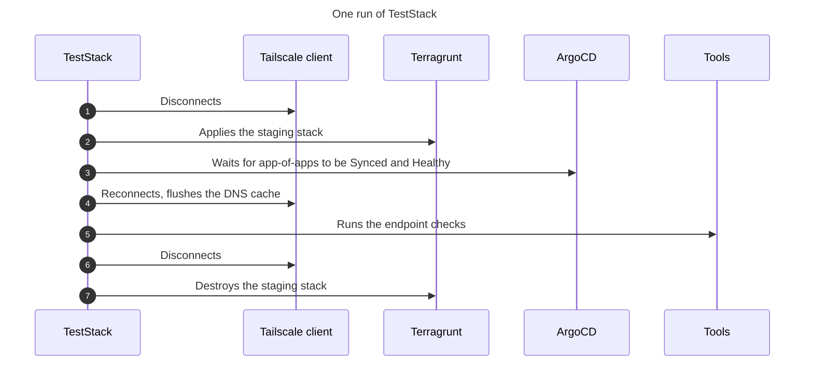

# How the Infrastructure Tests Work

The infrastructure tests deploy the whole `staging` stack, test it end to end, then destroy it. This page explains how they work.
For the steps to add a check, see [Add an Infrastructure Test](/docs/ci-cd/testing/add-an-infrastructure-test/).

## One Test for the Whole Stack
The tests are written with [Terratest](https://terratest.gruntwork.io/), a [Go](https://go.dev/) library for testing infrastructure code. A Terratest test is a regular Go test, so `go test` runs it, on your machine as in CI. EKS Forge uses it to run Terragrunt on the `staging` stack. The checks themselves are plain Go: HTTP requests to the tools, and `kubectl` commands against the cluster. The tests are in the [`tests/`](https://github.com/ConsciousML/terragrunt-template-live-eks/tree/main/tests) directory of the live repository.

There is no test per module or per unit. The [catalog CI](/docs/ci-cd/#three-pipelines) already validates and plans them, and a unit on its own proves little: an IAM role, a DNS record, or a Helm release only shows it works once the units around it use it. So the tests are functional: a single test deploys the stack and checks what comes out of all of them together.

The trade-off is time. A run builds a full cluster, and that's why CI only runs the tests on a pull request with the [`run-terratest` label](/docs/ci-cd/#why-terratest-needs-a-label).

## What the Tests Check
In CI, the `terratest` job runs `TestStack`, which:
1. Applies the `staging` stack.
2. Waits for ArgoCD's `app-of-apps` Application, which deploys the Kubernetes resources, to be `Synced` and `Healthy`.
3. Runs the endpoint checks.
4. Destroys the stack, even when a step failed.

The existing checks are the entries of `endpointChecks`, in [`tests/staging_stack_test.go`](https://github.com/ConsciousML/terragrunt-template-live-eks/blob/main/tests/staging_stack_test.go).

For what the tests can't catch, see [Limitations](/docs/ci-cd/limitations-and-improvements/#limitations).

## Why the Test Waits for ArgoCD
A finished Terragrunt apply doesn't mean a working cluster. Terragrunt installs ArgoCD and creates its `app-of-apps` Application, then returns. Most of the tools the tests check are deployed afterwards by ArgoCD, from the [app of apps repository](https://github.com/ConsciousML/argocd-app-of-apps-template).

So the test waits before it checks anything. It watches a single Application, `app-of-apps`: ArgoCD reports it `Synced` and `Healthy` only once every application it creates is (see [The Root App and Its Children](/docs/applications/how-the-app-of-apps-works/#the-root-app-and-its-children)). A new application is then covered by the wait without any change to the tests.

The test doesn't wait its whole budget on a broken application. `app-of-apps` itself can stay `OutOfSync` for a while as its children deploy one by one, so its own status doesn't tell a slow deployment from a stuck one. The test watches every Application instead: when none of them changes state for a while, it fails early, and prints the cluster's pods so the log shows which ones aren't running.

## What a Passing Check Proves
An endpoint check requests the tool's hostname from outside the cluster, the way you would from a browser. For the tool to answer, its DNS record, its certificate, its load balancer, its route, its network policies, and its pods all have to work. One `200` covers the whole chain, with no check written for any of its parts.

The tests hardcode no hostname and no password. They read each hostname from the output of the tool's `domain_name_<tool>` unit, and each admin password from the [Secrets Manager](https://aws.amazon.com/secrets-manager/) secret its unit created. The checks then follow whatever domain your fork is configured with, and that's why a tool needs a domain name unit before it can be checked (see [Add a Domain Name Unit](/docs/iac/add-a-domain-name-unit/)).

The trade-off is depth. A check proves a tool answers, and for ArgoCD and Grafana that it accepts its password, not that it does its job: Prometheus can answer `Healthy` while scraping nothing.

## Why Tailscale Disconnects and Reconnects
Every tool but podinfo has a private hostname, which only resolves through Tailscale (see [Connector and Split DNS](/docs/security/tailscale/#4-connector-and-split-dns)). Those DNS records are created during the run, so the test reconnects Tailscale and flushes the machine's DNS cache before the endpoint checks. It stays disconnected during the apply and the destroy, while the cluster's Tailscale connector isn't there.

The test runs the `tailscale` commands itself. That's why a full run on your machine asks you to leave Tailscale alone until it ends.

## Two Tests, One Set of Checks
`TestStack` and `TestStackExists` run the same checks, through the same `assertStack` function. `TestStackExists` skips everything else: it applies nothing, waits for nothing, and destroys nothing. A check added to `assertStack` then runs in CI and against a cluster you deployed yourself, with no second copy to keep in sync.

`TestStackExists` exists for writing checks. A new check rarely passes on the first attempt, and against a deployed `staging` each attempt takes minutes, not the hour of a full run. It has no use in CI, where no cluster is left between runs, so it skips itself there.

## When Staging Isn't Destroyed
The destroy runs when the test ends, whether it passed or failed. A failed run therefore leaves no cluster to inspect: its log is all that's left, and reproducing the failure means deploying `staging` again (see [Reproduce the Failure on Staging](/docs/ci-cd/per-repository/troubleshoot-live-ci/#reproduce-the-failure-on-staging)).

Two cases skip the destroy: a run that reaches its timeout, and a run that's cancelled or interrupted. In both, the test process is stopped before it gets to the destroy. The `staging` cluster then keeps running and being billed, and the next run fails on it, until you destroy it by hand (see [Destroy a Leftover Staging](/docs/ci-cd/per-repository/troubleshoot-live-ci/#destroy-a-leftover-staging)).

