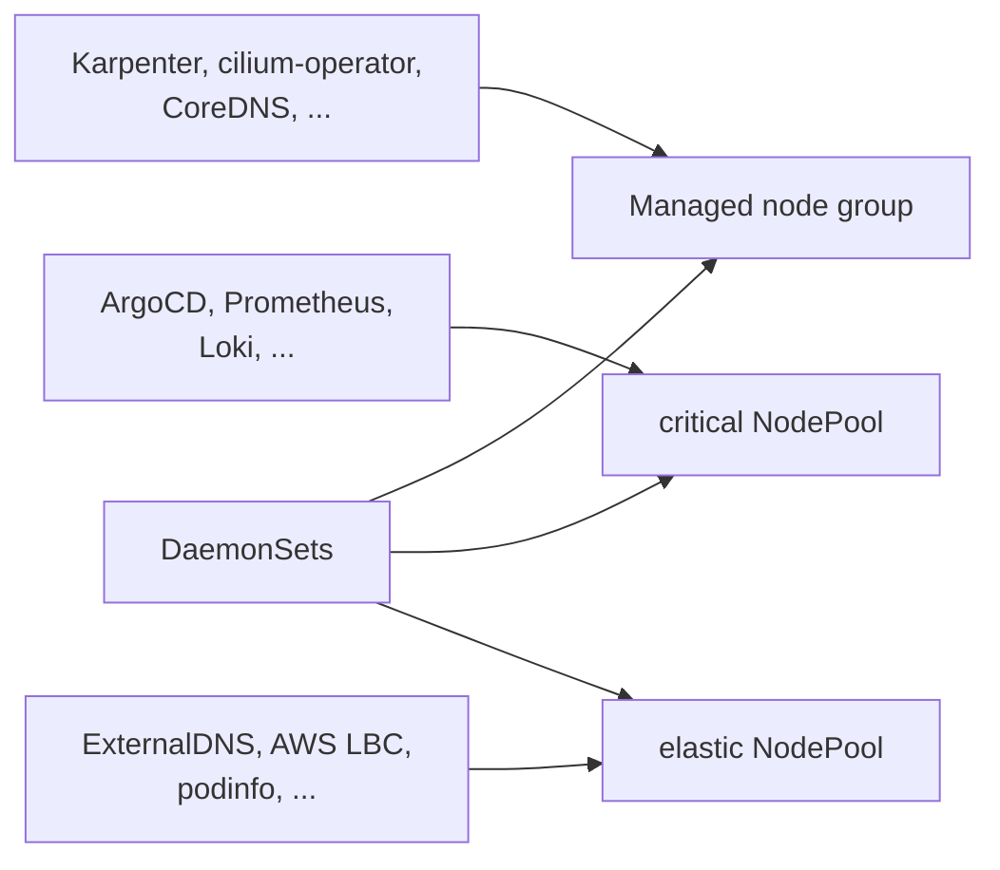
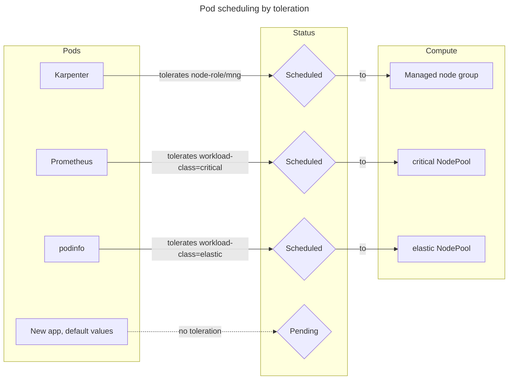
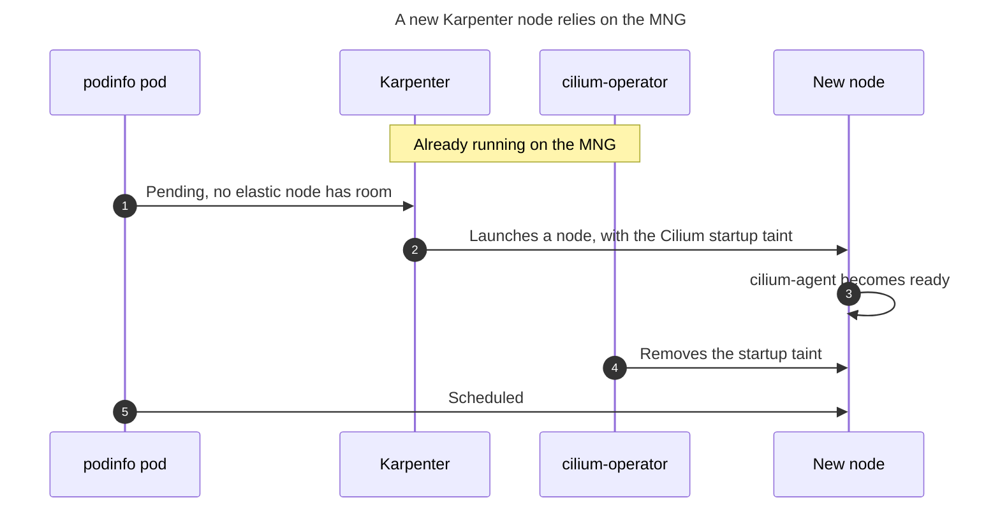
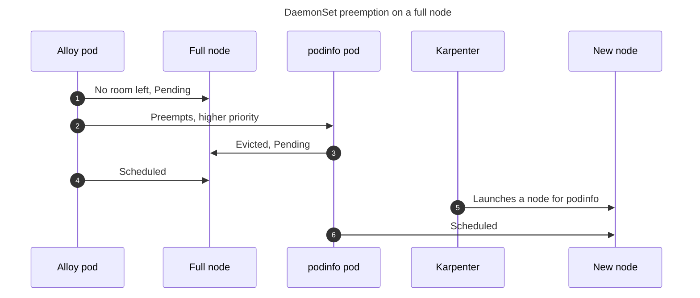

# How Pods Are Scheduled

EKS Forge runs your pods on three kinds of nodes, each tainted so that only the pods meant for it land there. This page explains why each one exists, and why none of them accepts a pod by default.
For the `nodeSelector` and `tolerations` to add to your pods, see [Schedule Pods](/docs/compute/schedule-pods/).

## Three Kinds of Nodes
The [managed node group](https://docs.aws.amazon.com/eks/latest/userguide/managed-node-groups.html) (MNG) is a fixed set of always-on nodes, created with the cluster and never scaled by [Karpenter](https://karpenter.sh/). Everything else runs on nodes Karpenter launches on demand, from one of two [NodePools](https://karpenter.sh/docs/concepts/nodepools/): `critical` and `elastic`.

## Why Every Node Is Tainted
There is no default pool. Every node carries a [taint](https://kubernetes.io/docs/concepts/scheduling-eviction/taint-and-toleration/), `node-role/mng` on the MNG and `karpenter.sh/workload-class` on both NodePools, so a pod only lands on a node whose taint it has a [toleration](https://kubernetes.io/docs/concepts/scheduling-eviction/taint-and-toleration/#concepts) for.

A pod that tolerates none of them stays `Pending`. Karpenter doesn't launch a node for it either, since it only launches nodes from a NodePool whose taints the pod tolerates.

This is deliberate. Where a pod runs decides how often it gets disrupted and how much it costs, so that choice is made explicitly for each workload. The MNG in particular can't be left untainted: its capacity is fixed, so any pod landing there by default could fill it up and starve the components the whole cluster relies on, bringing it down.

## The Managed Node Group
Some components can't wait for a Karpenter node, because Karpenter nodes depend on them. Karpenter can't run on the nodes it launches. [`cilium-operator`](https://docs.cilium.io/en/stable/internals/cilium_operator/) removes the startup taint that holds pods off a new Karpenter node until Cilium is ready there, so it must already be running elsewhere. The MNG gives them capacity that exists before any Karpenter node does (see [`eks_managed_node_groups`](https://github.com/ConsciousML/terragrunt-template-catalog-eks/blob/main/pipelines/dev/eks/stack/terragrunt.stack.hcl)).

It also hosts components the cluster needs even when Karpenter is unhealthy: CoreDNS, metrics-server, and Hubble, so you can still troubleshoot Karpenter node networking when no Karpenter node is working.

## The Karpenter NodePools
Both NodePools launch nodes on demand and remove them once they're no longer needed. What sets them apart is how willing Karpenter is to [disrupt](https://karpenter.sh/docs/concepts/disruption/) your pods to save money: moving them onto fewer or cheaper nodes, a process called [consolidation](https://karpenter.sh/docs/concepts/disruption/#consolidation).

### Critical NodePool
The [`critical` NodePool](https://github.com/ConsciousML/terragrunt-template-catalog-eks/blob/main/units/eks/addons/karpenter/node_pool/critical/terragrunt.hcl) trades cost for stability. Karpenter waits longer before consolidating its nodes, disrupts only one at a time, and gives pods time to shut down cleanly. It's for workloads where a restart at the wrong moment hurts, like ArgoCD, Prometheus, and Loki.

### Elastic NodePool
The [`elastic` NodePool](https://github.com/ConsciousML/terragrunt-template-catalog-eks/blob/main/units/eks/addons/karpenter/node_pool/elastic/terragrunt.hcl) trades stability for cost. Karpenter consolidates its nodes as soon as they're underused, disrupts many at once, and drains them fast. It's for workloads that recover from a restart on their own, like ExternalDNS, the AWS Load Balancer Controller, and podinfo.

### Comparison

| | Pros | Cons | When to use |
|---|---|---|---|
| **Managed node group** | Always on, exists before any Karpenter node, never consolidated | Fixed capacity, shared with the components the cluster relies on | Components Karpenter nodes depend on (Karpenter, `cilium-operator`, CoreDNS) |
| **Critical NodePool** | Rarely disrupted, one node at a time, pods get time to shut down cleanly | Costs more, since underused nodes stay up longer | Applications that must stay available |
| **Elastic NodePool** | Cheapest, nodes are removed as soon as they're underused | Pods restart often and get little time to shut down | Any other application |

## DaemonSets
A [DaemonSet](https://kubernetes.io/docs/concepts/workloads/controllers/daemonset/) runs one pod per node, like Alloy collecting each node's logs. So unlike other workloads, it tolerates every taint: the MNG's and both NodePools'.

Tolerating the taints isn't enough to land on every node, though. Karpenter only accounts for a DaemonSet's resources when it launches a node, so a DaemonSet added later can find existing nodes already full. Its pod then stays `Pending` there. The `daemonset-critical` [priority class](https://kubernetes.io/docs/concepts/scheduling-eviction/pod-priority-preemption/) prevents this: the pod evicts a lower-priority pod to make room, and Karpenter launches a new node for the evicted one.

This works because of how priorities are ordered:
1. Your workloads leave `priorityClassName` unset, so they sit at the default priority and DaemonSets can always evict them.
2. `daemonset-critical` sits above them.
3. Kubernetes' built-in `system-cluster-critical` and `system-node-critical` sit above `daemonset-critical`, so a DaemonSet never evicts Karpenter, CoreDNS, or the ArgoCD application-controller to fit.

For the priority value itself, see the [`priority-classes`](/docs/reference/manifests/priority-classes/) reference. For how DaemonSets also shape the order ArgoCD syncs applications in, see [DaemonSets Priority](/docs/applications/how-the-app-of-apps-works/#daemonsets-priority).
