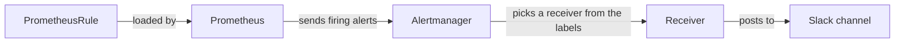
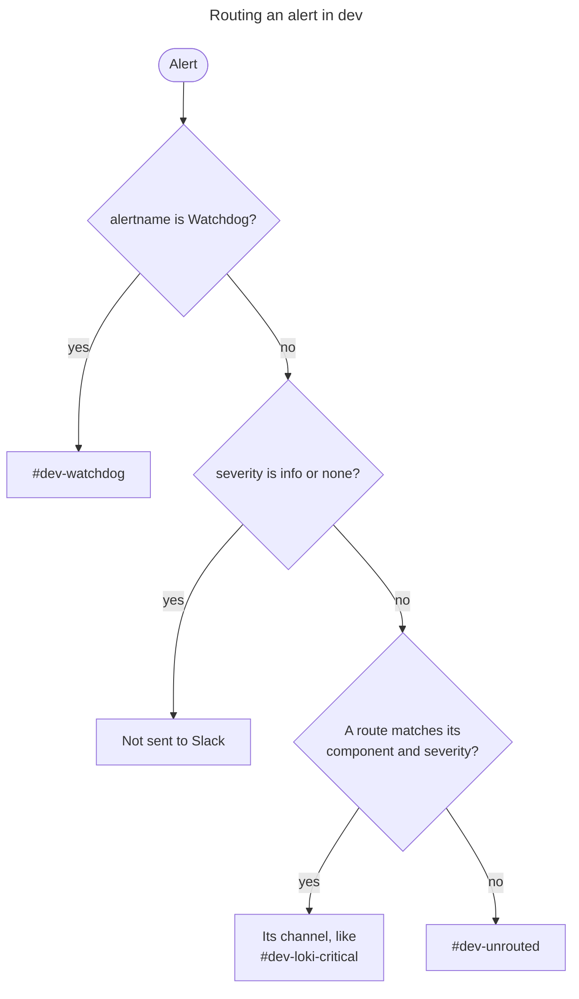
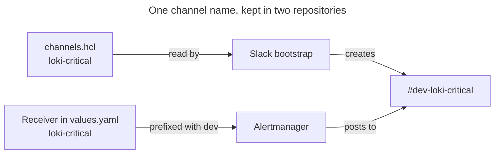

# How Alerting Works

EKS Forge sends each alert to a Slack channel named after its environment, its component, and its severity. This page explains why, and how the routing works.
For the steps to add your own alert, see [Add an Alert](/docs/monitoring/alerting/add-an-alert/). If you've never seen an alert reach Slack, follow [Follow an Alert](/docs/monitoring/get-started/alerts/) first.

## From a Rule to a Slack Message
An alert is defined as a rule in a [`PrometheusRule`](https://prometheus-operator.dev/docs/api-reference/api/#monitoring.coreos.com/v1.PrometheusRule). [Prometheus](https://prometheus.io/) checks each rule against its metrics, and sends the ones that fire to [Alertmanager](https://prometheus.io/docs/alerting/latest/alertmanager/). Alertmanager doesn't look at metrics. It only reads the labels of each alert, and picks a [receiver](https://prometheus.io/docs/alerting/latest/configuration/#receiver) from them. The receiver then posts the message to a Slack channel.

Each environment runs its own Prometheus and its own Alertmanager, in its own cluster. They share nothing but the Slack workspace.

## Routing by Component, Then Severity
Two labels decide where an alert lands. `component` says which part of the platform it's about, and `severity` says how urgent it is. Together they name the channel: `#<environment>-<component>-<severity>`, like `#prod-loki-critical`.

This is deliberate. In a single channel, an ArgoCD sync failure and a full disk scroll past each other, and muting the channel mutes everything. With one channel per component, you follow the parts you own and leave the rest. Splitting each component by severity then lets you set Slack to notify you for `critical`, and read `warning` when you have time.

| `component` | What its alerts watch |
|---|---|
| **`k8s`** | The cluster itself: nodes, pods, the Kubernetes API, the kubelet, and Karpenter |
| **`prometheus-stack`** | Prometheus, Alertmanager, and the Prometheus Operator |
| **`loki`** | Loki, and Alloy, which ships the logs to it |
| **`argocd`** | ArgoCD and the Applications it syncs |
| **`uptime`** | The endpoints the blackbox exporter probes, and their certificates |

The [routing tree](https://prometheus.io/docs/alerting/latest/configuration/#route) is a flat list of routes, under `alertmanager.config.route` in [`charts/monitoring/kube-prometheus-stack/values.yaml`](https://github.com/ConsciousML/argocd-app-of-apps-template/blob/main/charts/monitoring/kube-prometheus-stack/values.yaml). Alertmanager reads it from top to bottom, and stops at the first route whose matchers all fit. There is one route per pair of `component` and `severity`, and no two of them match the same alert, so their order doesn't matter. Only the first two routes have to stay on top.

The second route sends every alert with a `severity` of `info` or `none` to a receiver that posts nowhere. These alerts aren't meant for a person: `InfoInhibitor`, for example, only exists to mute other `info` alerts. The trade-off is that an `info` alert of your own never reaches Slack either, whatever its `component`.

## How an Alert Gets Its `component`
Almost every published rule follows the `severity` convention, so alerts already carry it. `component` is EKS Forge's own label, and no upstream rule has it. It's added in the app of apps repository, in a place that depends on where the rule comes from.

Most alerts are the default rules of the upstream [`kube-prometheus-stack`](https://github.com/prometheus-community/helm-charts/tree/main/charts/kube-prometheus-stack) chart, which EKS Forge doesn't write. The chart can add labels to every rule of a group, so `defaultRules.additionalRuleGroupLabels` maps each group to `k8s` or `prometheus-stack`.

Other charts ship alerts of their own, like Loki. When such a chart has a key that adds labels to all of its alerts, the `component` is set once there, as `monitoring.alerts.additionalRuleLabels` does in [`charts/monitoring/loki/values.yaml`](https://github.com/ConsciousML/argocd-app-of-apps-template/blob/main/charts/monitoring/loki/values.yaml).

The remaining rules are written in the app of apps repository. Some are standalone `PrometheusRule` manifests, in [`charts/monitoring/prometheus-rules/`](https://github.com/ConsciousML/argocd-app-of-apps-template/tree/main/charts/monitoring/prometheus-rules). Others are values passed to a chart that renders them, like the blackbox exporter's. Each of these rules carries `component` in its own `labels`, next to `severity`.

| Where the rule comes from | Where `component` is set | Example |
|---|---|---|
| **Default rules of `kube-prometheus-stack`** | Once per rule group, in `defaultRules.additionalRuleGroupLabels` | `KubePodCrashLooping` carries `k8s` |
| **An upstream chart's own alerts** | Once for the chart, in its key that labels every alert | Loki's alerts carry `loki` |
| **Rules written in the app of apps repository** | On each rule, in its `labels` | `EndpointDown` carries `uptime` |

A `component` names who deals with the alert, not which chart ships it. Alloy's alerts carry `loki`, since a broken Alloy means missing logs. Karpenter's carry `k8s`, since Karpenter provisions the cluster's nodes. This keeps the number of channels small: a new rule usually fits an existing component, and only something with its own owners needs a new one (see [Add an Alert Route & Slack Channel](/docs/monitoring/alerting/add-an-alert-route-and-slack-channel/)).

## Why Unmatched Alerts Go to `unrouted`
An alert that no route matches goes to the tree's default receiver, which posts to `#<environment>-unrouted`. That happens when the alert has no `component`, a `component` without a route, or a `severity` no route expects.

Alertmanager needs a default receiver, and an existing channel would have been the obvious choice. But a mislabeled alert would then sit among real ones, and nothing would tell you its routing is broken. A channel of its own makes the gap visible: a message in `#<environment>-unrouted` always means a label to fix or a route to add.

The trade-off is that nobody owns this channel. The alert isn't lost, but it only helps if someone looks, so the channel is meant to stay empty.

## Watchdog
`Watchdog` is a default rule that always fires, on a healthy cluster too. It doesn't report a problem. Its messages in `#<environment>-watchdog` show that the whole chain works, from Prometheus checking its rules to Alertmanager reaching Slack. Alertmanager posts it again every 12 hours.

It carries `severity: none`, so the `info|none` route would drop it. That's why the first route of the tree matches it by `alertname`, before anything else, and why those two routes have to stay on top.

The limit is that nothing fires when `Watchdog` stops. If alerting breaks, the only sign is a channel that went quiet, and someone has to notice. It's also why a silence on `Watchdog` hides the very failure it's there to reveal (see [Silence or Disable a Noisy Alert](/docs/monitoring/alerting/silence-or-disable-a-noisy-alert/)).

## Environment-Prefixed Channels
Each environment has its own Alertmanager, but they all post to the same Slack workspace, through the same bot. Without a prefix, a `dev` cluster being rebuilt would post next to a `prod` outage. With it, you can mute every `dev-` channel and keep the `prod-` ones loud.

The prefix isn't written anywhere in the app of apps repository. Each receiver's channel starts with a placeholder, and the catalog fills it with the environment's name at deploy time (see [`appParams` Injection](/docs/applications/how-the-app-of-apps-works/#appparams-injection)). The same routing tree then serves every environment.

Alertmanager posts to channels, it doesn't create them. The [Slack bootstrap](/docs/quickstart/bootstrap/slack/) does, once per environment, from a list of names without the prefix: [`pipelines/bootstrap/slack/channels.hcl`](https://github.com/ConsciousML/terragrunt-template-catalog-eks/blob/main/pipelines/bootstrap/slack/channels.hcl) in the catalog for `dev`, and [`live/bootstrap/slack/channels.hcl`](https://github.com/ConsciousML/terragrunt-template-live-eks/blob/main/live/bootstrap/slack/channels.hcl) in the live repository for `staging` and `prod`.

The trade-off is that each name lives in several places, and nothing checks that they agree. A receiver whose channel was never created fails quietly: no message shows up anywhere in Slack, and only Alertmanager's logs say why.

For the values behind the routing tree, see the [`kube-prometheus-stack` Helm Chart](/docs/reference/helm_charts/monitoring/kube-prometheus-stack/) reference. For the pipeline that creates the channels, see the [Slack Channels](/docs/reference/bootstrap/slack_channels/) reference.
