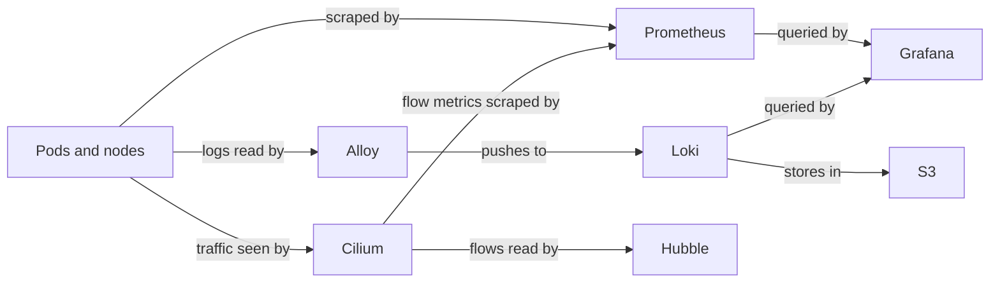
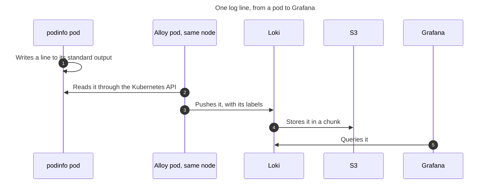

# How Monitoring Works

EKS Forge collects three signals from your cluster: metrics, logs, and network flows. This page explains how the tools that collect them fit together, and why EKS Forge configures them the way it does.
For a hands-on tour of the tools, see [Monitor Your Cluster](/docs/monitoring/get-started/).

## Overview
[Prometheus](https://prometheus.io/) collects and stores metrics. [Alloy](https://grafana.com/docs/alloy/latest/) collects logs, and [Loki](https://grafana.com/docs/loki/latest/) stores them. [Cilium](https://cilium.io/) sees network flows, and [Hubble](https://docs.cilium.io/en/stable/observability/hubble/) shows them. [Grafana](https://grafana.com/docs/grafana/latest/) queries Prometheus and Loki to show metrics and logs in dashboards. Hubble has its own UI for flows.

## Why Prometheus Picks Up Every Monitor
Prometheus scrapes the targets that the [`ServiceMonitor`](https://prometheus-operator.dev/docs/api-reference/api/#monitoring.coreos.com/v1.ServiceMonitor) and [`PodMonitor`](https://prometheus-operator.dev/docs/api-reference/api/#monitoring.coreos.com/v1.PodMonitor) resources of the cluster describe. By default, the [`kube-prometheus-stack`](https://github.com/ConsciousML/eks-forge-app-of-apps/tree/main/charts/monitoring/kube-prometheus-stack) chart only selects the monitors that carry its own release label.

EKS Forge removes that filter (see `serviceMonitorSelectorNilUsesHelmValues` in [`values.yaml`](https://github.com/ConsciousML/eks-forge-app-of-apps/blob/main/charts/monitoring/kube-prometheus-stack/values.yaml)). Prometheus picks up every monitor in the cluster, whatever its labels or its namespace. An app then opts in from its own chart, by shipping a monitor next to its `Deployment`, and nothing changes in `kube-prometheus-stack`. For the steps, see [Monitor a New App](/docs/monitoring/monitor-a-new-app/).

## Why the Catalog Installs the CRDs
A `ServiceMonitor` is a custom resource, so its definition (CRD) has to exist before any chart can create one. `kube-prometheus-stack` can install the CRDs itself, but ArgoCD is what deploys it, and ArgoCD's own chart ships a `ServiceMonitor`. So do Cilium's and Karpenter's, which the catalog also installs before ArgoCD.

So the catalog installs the CRDs with Terraform, in the [`prometheus_stack/crds`](https://github.com/ConsciousML/eks-forge-catalog/tree/main/units/eks/addons/prometheus_stack/crds) unit, and the ArgoCD, Cilium, and Karpenter units depend on it. `kube-prometheus-stack` leaves the CRDs alone, and the unit stays their only owner.

## Why Each Prometheus Replica Has Its Own Storage
Prometheus runs as several replicas, each on its own node and with its own [EBS](https://aws.amazon.com/ebs/) volume (see `prometheus.prometheusSpec.replicas` in [`values.yaml`](https://github.com/ConsciousML/eks-forge-app-of-apps/blob/main/charts/monitoring/kube-prometheus-stack/values.yaml)). They share nothing: each scrapes every target and stores its own copy, so losing one loses no metrics. This is how Prometheus is [made highly available](https://prometheus-operator.dev/docs/platform/high-availability/), with no shared storage to run.

The trade-off is that the copies are never exactly the same, since each replica scrapes at its own moment. A graph could then jump between two refreshes, so the `Service` keeps a client on the same replica (see `sessionAffinity` in the same file).

`prod` keeps the volumes when Prometheus is deleted. `dev` and `staging` delete them, to save costs (see [Environment Overlays](/docs/applications/how-the-app-of-apps-works/#environment-overlays)).

## Why Grafana Has No Volume
Grafana loads its datasources and its dashboards when its pod starts, from the chart's values. Some dashboards come from a `ConfigMap` another chart ships instead, as Cilium's does for the Hubble dashboards. Adding a dashboard is then a git change, reviewed and identical in every environment, and replacing the pod loses nothing.

The trade-off is that a dashboard built in the UI disappears with the pod (see [Add a Grafana Dashboard](/docs/monitoring/add-a-grafana-dashboard/)).

## Why Alloy Reads Logs Through the Kubernetes API
Alloy runs one pod per node, reads the logs of the pods on that node, and sends them to Loki. An app has nothing to set up: whatever it writes to its standard output is collected.

Alloy reads the logs [through the Kubernetes API](https://grafana.com/docs/alloy/latest/collect/logs-in-kubernetes/), not from the log files on the node's disk. It then needs no access to the node's filesystem, and runs as a non-root user with a read-only filesystem of its own.

The trade-off is that every log line goes through the Kubernetes API, which takes more network traffic and more kubelet CPU than reading the files.

Alloy also collects the cluster's [events](https://kubernetes.io/docs/reference/kubernetes-api/cluster-resources/event-v1/), which Kubernetes deletes about an hour after they happen. In Loki, they stay as long as the logs do.

It attaches only a few labels to each line, such as `namespace`, `pod`, `container`, and `app` (see [`charts/monitoring/alloy/values.yaml`](https://github.com/ConsciousML/eks-forge-app-of-apps/blob/main/charts/monitoring/alloy/values.yaml)). Loki gets slower with every label that has many values (see Loki's [label best practices](https://grafana.com/docs/loki/latest/get-started/labels/bp-labels/)).

## Why Logs Go to S3
Loki keeps the logs in [S3](https://aws.amazon.com/s3/). Logs grow much faster than metrics. S3 needs no capacity planning, and costs less per gigabyte than a volume. Each replica only keeps a volume for the lines it hasn't written to S3 yet (see Loki's [write-ahead log](https://grafana.com/docs/loki/latest/operations/storage/wal/)).

The buckets are AWS resources, so the catalog creates them, along with the IAM role that lets Loki read and write them through [EKS Pod Identity](https://docs.aws.amazon.com/eks/latest/userguide/pod-identities.html) (see the [`loki`](https://github.com/ConsciousML/eks-forge-catalog/tree/main/units/eks/addons/loki) units). It passes the bucket names to Loki's chart through [`appParams`](/docs/applications/how-the-app-of-apps-works/#appparams-injection).

Loki deletes the logs older than its retention period on its own (see `retention_period` in [`charts/monitoring/loki/values.yaml`](https://github.com/ConsciousML/eks-forge-app-of-apps/blob/main/charts/monitoring/loki/values.yaml)).

Loki runs in [monolithic mode](https://grafana.com/docs/loki/latest/get-started/deployment-modes/), as several replicas spread across availability zones (see `singleBinary.replicas` in the same file). Each log line is written to more than one replica, so one can go down without losing logs or refusing new ones.

The trade-off is scale. Monolithic mode is the simplest to run, but Loki's documentation places its limit at about 20GB of logs per day. Past that, one of Loki's other [deployment modes](https://grafana.com/docs/loki/latest/get-started/deployment-modes/) is needed.

## Why Hubble Stores No Flows
Network flows have no dedicated collector. Cilium already sees every connection of the pods it manages, since it's what allows or drops them (see [Cilium VPC CNI Chaining](/docs/security/how-network-policies-work/#cilium-vpc-cni-chaining)). Hubble exposes what Cilium saw.

Each Cilium agent only holds its latest flows, in a [buffer in memory](https://docs.cilium.io/en/stable/internals/hubble/#the-observer-service), and EKS Forge exports them nowhere else. Hubble shows recent flows only. This fits its main use: watching a flow get dropped while you write a network policy.

What EKS Forge keeps is the flow metrics. The catalog enables them in Cilium's settings (see `hubble` in the [stack file](https://github.com/ConsciousML/eks-forge-catalog/blob/main/pipelines/dev/eks/stack/terragrunt.stack.hcl)), and Prometheus scrapes and stores them like any other metric. The Hubble dashboards in Grafana are built on them, so they still show a spike of drops from last week, without the flows behind it.

Hubble Relay and the Hubble UI run on the managed node group, so Hubble stays up when the Karpenter nodes are the ones failing (see [The Managed Node Group](/docs/compute/how-pods-are-scheduled/#the-managed-node-group)).

Hubble inherits the limits of chaining mode: it shows no HTTP or DNS detail, and nothing for a pod Cilium doesn't manage (see [Pods Cilium Doesn't Manage](/docs/security/how-network-policies-work/#pods-cilium-doesnt-manage)).

## What AWS Covers for the Control Plane
On EKS, AWS runs the [control plane](https://kubernetes.io/docs/concepts/architecture/#control-plane-components): the API server, etcd, the scheduler, and the controller manager. None of them is a pod in your cluster. The monitors `kube-prometheus-stack` ships for etcd, the scheduler, and the controller manager target pods that don't exist on EKS, so the chart turns them off (see `kubeEtcd` in [`values.yaml`](https://github.com/ConsciousML/eks-forge-app-of-apps/blob/main/charts/monitoring/kube-prometheus-stack/values.yaml)).

The API server is the exception. Prometheus reaches it like any client of the cluster does, so its metrics are in Grafana with the rest.

AWS exposes the control plane itself, as graphs in the EKS console. It also serves the raw metrics of the scheduler and the controller manager, in the Prometheus format, through the `metrics.eks.amazonaws.com` API (see [Explore Your Control Plane](/docs/monitoring/get-started/control-plane/)). etcd has no such endpoint. EKS Forge doesn't scrape these metrics into Prometheus, so the scheduler and the controller manager have no Grafana dashboard and no alert of their own.

The control plane's [logs](https://docs.aws.amazon.com/eks/latest/userguide/control-plane-logs.html) don't go to Loki either. EKS sends them to [CloudWatch](https://aws.amazon.com/cloudwatch/), which bills what it ingests and stores. Each log type is enabled on its own. `staging` and `prod` enable the API server's only, and `dev` enables none to save costs (see `enabled_log_types` in the [`dev`](https://github.com/ConsciousML/eks-forge-catalog/blob/main/pipelines/dev/eks/stack/terragrunt.stack.hcl) and [`prod`](https://github.com/ConsciousML/eks-forge-live/blob/main/live/prod/eks/stack/terragrunt.stack.hcl) stack files).
