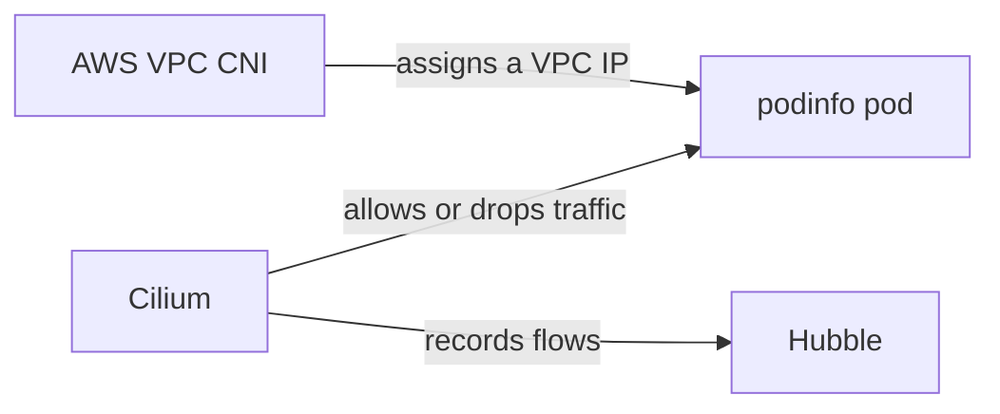
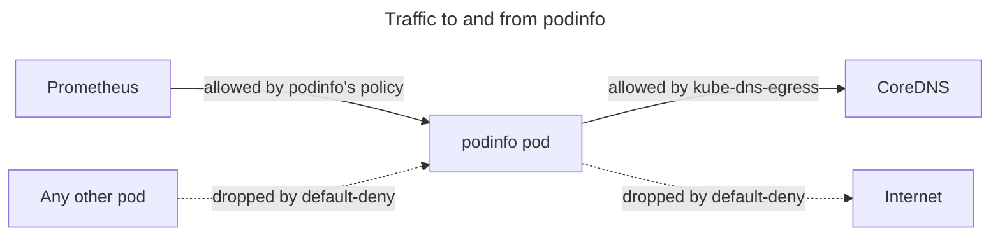
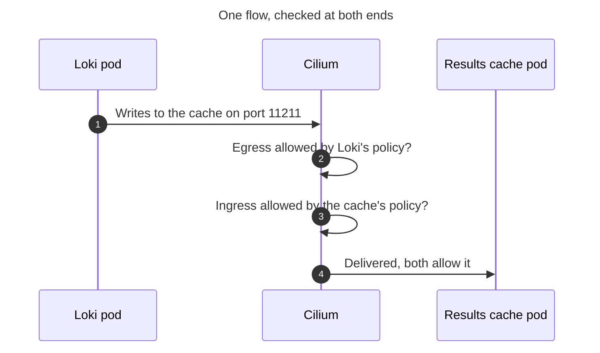
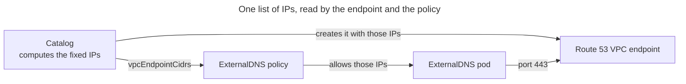

# How Network Policies Work

EKS Forge denies all network traffic in the namespaces it manages, then allows each flow a pod needs, one by one. This page explains why, and how its policies fit together.
For the rules to write for your own app, see [Write Network Policies](/docs/security/write-network-policies/).

## Cilium VPC CNI Chaining
The [AWS VPC CNI](https://docs.aws.amazon.com/eks/latest/userguide/managing-vpc-cni.html) gives every pod an IP from the VPC. [Cilium](https://docs.cilium.io/en/stable/) runs on top of it, in chaining mode. Cilium assigns no IPs here: it only allows or drops the pod's traffic, and records each flow for [Hubble](https://docs.cilium.io/en/stable/observability/hubble/).

EKS Forge keeps the VPC CNI for pod networking because it is robust: it is AWS's own plugin, built and supported for EKS. It adds Cilium because Cilium handles network policies better than the VPC CNI's own enforcement. A Cilium rule can name the node, the Kubernetes API, or the internet directly, instead of listing IP ranges. And Hubble shows each flow with the pods on both ends and whether it was dropped, where the VPC CNI only logs IPs.

Chaining comes with a limit. A policy can match who the peer is ([Layer 3](https://docs.cilium.io/en/stable/security/policy/layer3/)) and which port it uses ([Layer 4](https://docs.cilium.io/en/stable/security/policy/layer4/)), but not what the traffic contains ([Layer 7](https://docs.cilium.io/en/stable/security/policy/layer7/)), like an HTTP path. Rules on DNS names ([`toFQDNs`](https://docs.cilium.io/en/stable/security/policy/layer3/#dns-based)) need Layer 7 too, so they don't work either. For the full list, see Cilium's [AWS VPC CNI Chaining](https://docs.cilium.io/en/stable/installation/cni-chaining-aws-cni/).

## Why Traffic Is Denied by Default
In the namespaces EKS Forge manages, nothing is allowed by default. [`default-deny.yaml`](https://github.com/ConsciousML/argocd-app-of-apps-template/blob/main/manifests/network-policies/cluster-wide/default-deny.yaml) lists them, and Cilium drops all traffic to and from every pod in them. A flow only goes through once another policy allows it.

This is deliberate. Without it, any pod can reach any other pod in the cluster, and anything outside it. A compromised pod could then read from Loki, call the Kubernetes API, or send data out to the internet. With everything denied first, it reaches only the peers its policies name.

Policies add up. Cilium combines every policy that selects a pod, and a flow goes through if any one of them allows it. A policy with only egress rules denies the rest of its pod's egress, and leaves its ingress open.

`default-deny.yaml` replaces one default-deny policy per namespace. The list of protected namespaces sits in one place, and a pod is denied in both directions even when it has no policy of its own.

The deny is opt-in per namespace, though. In a namespace missing from `default-deny.yaml`, a pod that no policy selects can talk to anything, so a new app's namespace has to be added to the list before any of this protects it.

## Two Kinds of Policies
The allow rules come from two kinds of policies. A [`CiliumClusterwideNetworkPolicy`](https://docs.cilium.io/en/stable/network/kubernetes/policy/#ciliumclusterwidenetworkpolicy) covers a concern several namespaces share, like resolving DNS. There is one file per concern in [`manifests/network-policies/cluster-wide/`](https://github.com/ConsciousML/argocd-app-of-apps-template/tree/main/manifests/network-policies/cluster-wide), each listing the namespaces it applies to. Allowing DNS for a new namespace is then one line, not a rule copied into every app.

A [`CiliumNetworkPolicy`](https://docs.cilium.io/en/stable/network/kubernetes/policy/#ciliumnetworkpolicy) covers a concern specific to one component, like Prometheus scraping podinfo. It lives next to the workload it protects, as [`manifests/podinfo/podinfo-network-policy.yaml`](https://github.com/ConsciousML/argocd-app-of-apps-template/blob/main/manifests/podinfo/podinfo-network-policy.yaml) does, so an app and its rules change together. A chart with several components gets one policy per component, each selecting its own pods, so Loki's cache can't do what Loki itself is allowed to.

| | Applies to | Lives in | When to use |
|---|---|---|---|
| **`CiliumClusterwideNetworkPolicy`** | Every pod of the namespaces it lists | `manifests/network-policies/cluster-wide/` | A concern several namespaces share (DNS, the Kubernetes API, EKS Pod Identity) |
| **`CiliumNetworkPolicy`** | The pods of one component | Next to the workload, in its chart or manifests | A concern specific to one component (a scrape, a probe, a call to another app) |

## Why Both Ends Need a Rule
Cilium enforces policy at each pod separately. When Loki writes to its results cache, the flow is checked twice: as it leaves Loki, against Loki's egress rules, and as it enters the cache, against the cache's ingress rules. Both pods are denied by default, so each needs a rule pointing at the other.

The egress check comes first. If it fails, the flow is dropped before it ever reaches the cache, and Hubble reports that one drop only. A missing ingress rule on the cache only shows up once the egress rule is fixed, which is why both rules are best written together.

## Identities, Not IPs
A pod's IP changes every time it restarts, so rules don't name IPs. Cilium gives each pod an [identity](https://docs.cilium.io/en/stable/security/network/identity/) built from its labels and its namespace, and a rule selects peers by those labels. podinfo allows `app.kubernetes.io/name: prometheus` in the `monitoring` namespace, and the rule keeps working whichever node or IP Prometheus lands on.

Some peers aren't pods, so they have no labels to select. Cilium groups them into [entities](https://docs.cilium.io/en/stable/security/policy/layer3/#entities-based):
- `host`: the node the pod runs on.
- `remote-node`: any other node of the cluster.
- `kube-apiserver`: the Kubernetes API.
- `world`: anything outside the cluster.
- `cluster`: everything inside the cluster.

An entity can also replace a long list of namespaces. Every namespace resolves DNS, so CoreDNS allows port 53 from `cluster` instead of naming each one. Prometheus does the same in the other direction: it scrapes pods in every namespace, so its egress allows `cluster`. That's why a new app changes nothing in CoreDNS's or Prometheus's policy: it only needs its namespace in `kube-dns-egress.yaml`, and an ingress rule for Prometheus in its own policy.

### The `host` Entity
The kubelet runs on the node and probes your pods from there, so its health checks arrive as `host`. The [EKS Pod Identity agent](https://docs.aws.amazon.com/eks/latest/userguide/pod-id-how-it-works.html) answers on an address the node owns, so a pod asking it for AWS credentials sends to `host` as well.

Pods that use the node's network (`hostNetwork: true`), like `aws-node`, `kube-proxy`, and `cilium`, share the node's IP, so they carry the `host` identity too. Seen from another node, they are `remote-node`.

No policy can select these pods one by one, and `default-deny.yaml` doesn't reach them, which is why none of them has a policy. Restricting them takes Cilium's [host firewall](https://docs.cilium.io/en/stable/security/host-firewall/), which EKS Forge doesn't enable.

The trade-off is that `host` is broad. A rule allowing it for kubelet probes also admits every `hostNetwork` pod on that node.

### The `world` Entity
A load balancer sits inside the VPC, yet its traffic arrives as `world`. It forwards requests and health checks straight to the pod's IP, and its network interfaces aren't pods or nodes of the cluster, so Cilium has no identity for them.

`world` is broad too: a rule allowing it admits any source outside the cluster. Two layers narrow it down. The node's security group only lets the load balancer in, and the pod's policy only opens the port the app serves on. For example, the first ingress rule of [`podinfo-network-policy.yaml`](https://github.com/ConsciousML/argocd-app-of-apps-template/blob/main/manifests/podinfo/podinfo-network-policy.yaml) allows `world` on port 9898 only.

### Pods Cilium Doesn't Manage
Cilium only gives an identity to pods created after its agent is ready on their node. A pod started earlier still gets an IP from the VPC CNI, but no identity, so every policy sees it as `world`. Rules that select it by label don't match it, so its peers drop its traffic. Cilium also enforces nothing on the pod itself: `default-deny.yaml` doesn't apply to it, and Hubble doesn't show its flows.

EKS Forge closes this gap in two places:
- On Karpenter nodes, a startup taint holds pods off a new node until Cilium is ready there (see [The Managed Node Group](/docs/compute/how-pods-are-scheduled/#the-managed-node-group)).
- Pods created with the cluster, like CoreDNS and metrics-server, start before Cilium exists. The [`cep_restart` unit](https://github.com/ConsciousML/terragrunt-template-catalog-eks/tree/main/units/eks/addons/cilium/cep_restart) restarts every workload with such a pod right after Cilium is installed, and again after each Cilium upgrade.

## Reaching AWS APIs
A pod calling an AWS API, like ExternalDNS calling Route 53, isn't talking to a pod. The only entity that fits is `world`, which would also open the whole internet on port 443, and rules on DNS names aren't available. Its policy needs IPs, so the catalog gives each [interface VPC endpoint](https://docs.aws.amazon.com/vpc/latest/privatelink/vpce-interface.html) a fixed IP in every private subnet, and passes those IPs to the app's chart as `vpcEndpointCidrs`. The policy then allows only those IPs, on port 443.

Not every destination has an IP to pin. S3 uses a [gateway endpoint](https://docs.aws.amazon.com/vpc/latest/privatelink/gateway-endpoints.html), which is an entry in the route table, not a network interface. So Loki's policy allows `world` on port 443 to reach its buckets, even though that traffic never leaves AWS. The same goes for anything outside AWS, and for an AWS service with no endpoint yet (see [Add a VPC Endpoint](/docs/iac/add-a-vpc-endpoint/)).

## Avoiding a Lockout
`argocd` and `kube-system` are in `default-deny.yaml` like any other namespace, and they're the risky ones. ArgoCD is what syncs the policies, and it needs CoreDNS and the Kubernetes API to do it. If the deny reached them before their allow rules, ArgoCD would be cut off with nothing left to sync the fix.

So neither namespace is listed in `kube-dns-egress.yaml` or `kube-apiserver-egress.yaml`. Each carries its own copy of those two allow rules, in an Application of its own: `argocd-network-policies` and `network-policies-kube-system`. Both sync one [wave](/docs/applications/how-the-app-of-apps-works/#sync-waves) before `network-policies-cluster-wide`, so the allow rules exist before the deny does, and they stay in place even if `network-policies-cluster-wide` fails to sync.

These two Applications hold policies only, away from the workloads they protect. ArgoCD, CoreDNS, Karpenter, and the other `kube-system` addons are installed by Terraform or by EKS, so the app of apps repository has no chart of theirs to put a policy in. It works because Cilium matches pods by labels and namespace, whoever deployed them.

For what each of these policies allows, see the [`network-policies-cluster-wide`](/docs/reference/manifests/network-policies/cluster-wide/), [`argocd-network-policies`](/docs/reference/manifests/network-policies/argocd/), and [`network-policies-kube-system`](/docs/reference/helm_charts/network-policies/kube-system/) references.